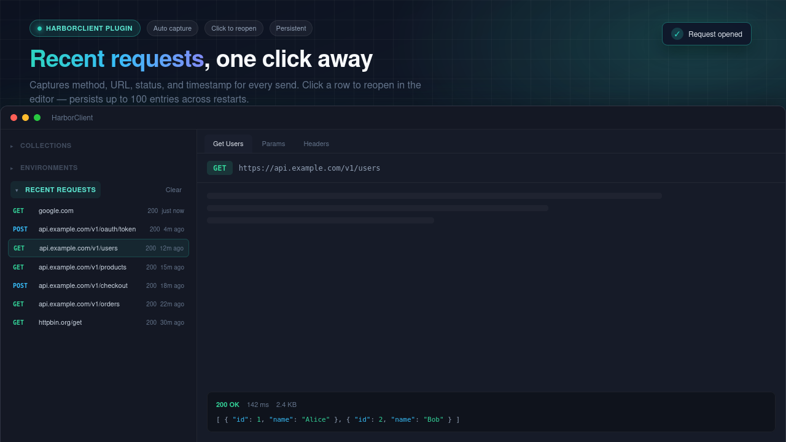

# Recent Requests

A HarborClient plugin that records every completed HTTP request and displays them in a **Recent Requests** sidebar section below Collections and Environments.




## Features

- Captures method, URL, status code, and timestamp for each send
- Collapsible sidebar section matching the built-in Collections / Environments pattern
- Persists history across app restarts in a private SQLite database (up to 100 entries)
- Click a row to open the request in the editor (collection requests reopen their saved tab; others open a draft with captured method, URL, headers, params, and body)
- Clear button to remove all recent entries

## Permissions

| Permission | Purpose                                            |
| ---------- | -------------------------------------------------- |
| `ui`       | Sidebar section and toasts                         |
| `database` | Private SQLite database for recent request history |
| `http`     | Observe completed HTTP requests (main process)     |

## Limitations

- Only **completed** exchanges are recorded. Network-level failures (DNS, timeout, connection refused) are not captured because the host fires `onAfterSend` only when `result.error` is absent.
- HTTP error responses (4xx, 5xx) **are** recorded.
- Saved collection requests reopen only when that request is already loaded in memory or its collection is open in the sidebar cache.
- Upgrading from versions that used `hc.storage` does not carry over existing history; history starts fresh in the plugin database.

## Development

```bash
pnpm install
pnpm build
```

Load the plugin folder via **Settings → Plugins → Load unpacked…**, then enable it.

For day-to-day work:

```bash
pnpm dev
HARBOR_PLUGINS_DEV=/path/to/harborclient-plugin-recent-requests pnpm dev
```

(in the HarborClient app checkout)
